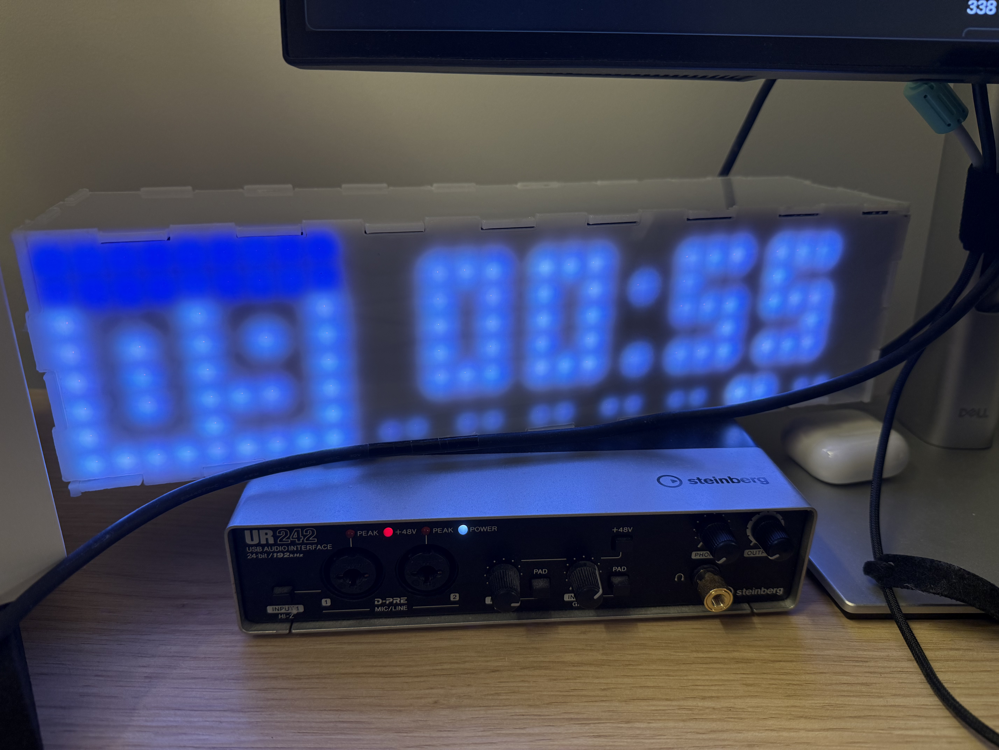
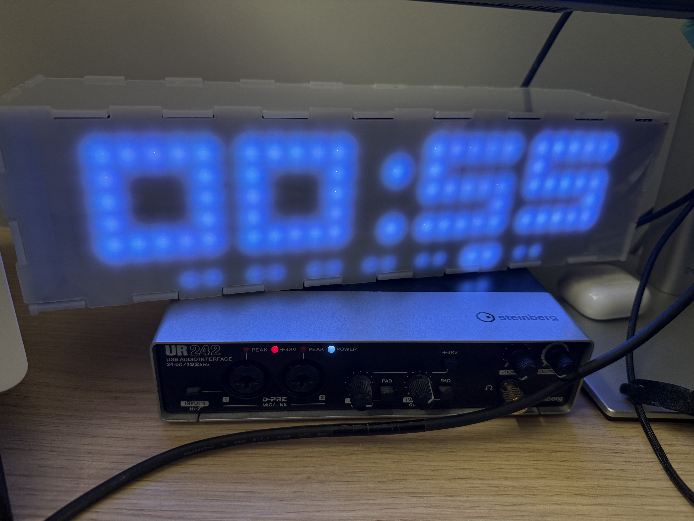

# Matrix display Clock

A Matrix clock build on raspberrypi zero. (kinda like the LaMetric Time)
WIP

## Gallery






## Features
Movable widgets, multiple screen environments, animations.
A control panel in which you can edit just about everything, widget position, widget code etc.

You don't have to worry about the built-in clock in Raspberry-Pi Zero slightly changing over time, because every now and then this software automatically synchronizes with a time server online. 


### Widgets

Widgets that are provided out-of-the-box:
 - Days of Week (with bars that look like this if you're on a Saturday: ░░ ░░ ░░ ░░ ░░ ▓▓ ░░)
 - Calendar (indicates the current date with a nice calendar-like background)
 - Digital Time: 3x5 font, HH : MM (: SS, configurable)
 - Big Digital Time: 5x5 font, HH : MM
 - Rss Feed: Scrolls news headlines on the display, 8x8 font, supports Latin, Cyrillic, Japanese Kana&Kanji
 - Temperature: <temperature>°C
 - Weather: A nice 8x8 widget with animated icons for every weather type, with even a particle system for rain

### Screens

Screens are like Desktops on Windows or on Mac, with widgets placed on them, and based on time/events (like if the clock recieves an RSS update from a news source) the screens will cycle with a nice little animation.

### Control panel

With the help of the control panel you can do a lot of things:
 - Change the password
 - View what's on the display
 - Change the brightness
 - Restart
 - Edit Widgets / Create new ones using JavaScript right in your browser (using Monaco Editor)
 - Edit Screens / Create new ones by dragging and dropping the widgets on a virtual screen


# How to Use

Get an API key from weatherapi.com
Paste it in the file /code/src/widgets/weather/weather.js (WIP, will be moved to the Control Panel)

Put your RSS feeds in the file /code/src/widgets/rssFeed/rss.js (WIP, will also be moved to be edited in the Control Panel)

Create a systemctl service to autorun
```
#!/bin/bash
cd <the directory you're doing to put the contents of the code folder in>
sudo node src/main.js
```
and name it script-startup.service

And you're good to go.

To connect the ws281x screen, connect it to GPIO 18, or change the /code/src/utils/driver.js file to another pin.


License: MIT
